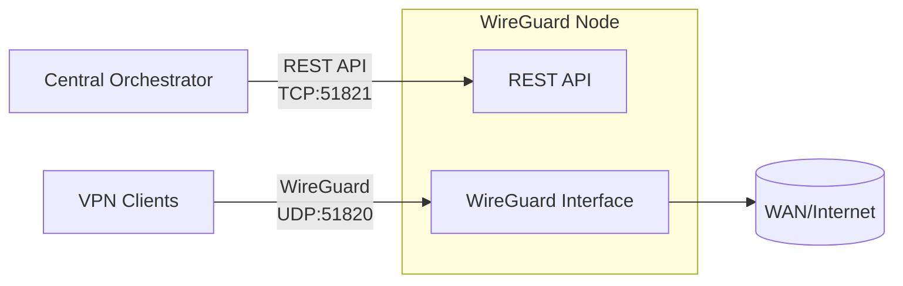

# WG Keeper node

WG Keeper node bundles a WireGuard interface with REST API for
peer management on a Linux host. It is designed to be a secure, minimal node
managed by a single admin layer that orchestrates multiple nodes via HTTP API.

## Why this project

This project keeps the node lean and security-focused with a small surface area
and strict API control. It is built for clean automation, predictable operations,
and low operational overhead.

## Key features

- built for central orchestration at scale: manage many nodes through a single API layer;
- security-first design with a minimal attack surface;
- resilient peer provisioning: automatic IP allocation and key rotation;
- post-quantum resilience via per‑peer preshared keys;
- operational visibility: WireGuard stats, peer activity, and auto-config generation.

## Security model

- API key authentication on all protected endpoints.
- Restrictive WireGuard config permissions and minimal host surface area.
- **Rate limiting:** When `server.allowed_ips` is **not** set, the API applies per–client-IP rate limiting (20 requests/second, burst 30) to reduce brute-force and abuse. When `server.allowed_ips` is set, rate limiting is **not** applied so that trusted orchestrator IPs are not limited.
- Request body size is limited (256 KB); larger bodies receive 413 Request Entity Too Large.
- Security headers on all responses: `X-Content-Type-Options`, `X-Frame-Options`, `X-XSS-Protection`, `Referrer-Policy`; `Strict-Transport-Security` when using TLS.
- Each response includes `X-Request-Id` (UUID v4) for correlation with logs and for integrating external monitoring (e.g. Prometheus, OpenTelemetry).

## Architecture



## Limitations

- **In-memory peer state (default):** If `wireguard.peer_store_file` is not set, the mapping of peer IDs to peers is stored only in memory. After a process restart, this state is lost. See [Peer store persistence](#peer-store-persistence) for optional file-based persistence.

## Requirements

- Linux host with WireGuard support.
- Root privileges or permission to manage network interfaces.
- For Docker you need `NET_ADMIN` and `SYS_MODULE`.
- If you run locally, the host must have `wireguard-tools`, `iproute2`, `iptables`.

## Configuration

Copy the example and edit it with your values:

```
cp config.example.yaml config.yaml
```

By default, the application looks for `./config.yaml`.
You can set the path explicitly:

```
NODE_CONFIG=/path/config.yaml
```

Key settings:

- `server.port`: API port (HTTP or HTTPS depending on TLS).
- `server.tls_cert`, `server.tls_key`: optional paths to TLS certificate and private key (PEM). If both are set, the API runs over HTTPS with TLS 1.2+; otherwise it runs over HTTP.
- `server.allowed_ips`: optional list of IPv4 addresses or CIDRs (e.g. `10.0.0.0/24`, `192.168.1.1`). When set, only requests from these IPs are accepted for protected endpoints (stats, peers); `/health` remains reachable from any IP. Omit or leave empty to allow all.
- `auth.api_key`: API key for protected endpoints.
- `DEBUG`: set to `true` or `1` to enable debug mode (verbose Gin logs and detailed error messages in API responses). Do not use in production.
- `wireguard.interface`: interface name (e.g., `wg0`).
- `wireguard.subnet`: IPv4 CIDR subnet for peer allocation.
- `wireguard.listen_port`: WireGuard UDP port.
- `wireguard.server_ip` (optional): server IP inside subnet.
- `wireguard.peer_store_file` (optional): path to a JSON file for persistent peer store. If set, peers are loaded from this file on startup and saved on every change. Omit or leave empty for in-memory only.
- `wireguard.routing.wan_interface`: WAN interface for NAT rules.

## Peer store persistence

When `wireguard.peer_store_file` is set (e.g. `peers.json`), the node:

- **On startup:** Loads peer records from the file (if the file does not exist, starts with an empty store). Then reconciles with the WireGuard device (removes from store any peer whose public key is no longer on the interface, e.g. after a host reboot) and with the current config subnets (removes from store and from the device any peer whose `allowed_ips` are not entirely within the current `wireguard.subnet` / `wireguard.subnet6`). If anything was removed, the file is rewritten.
- **On every change:** After creating, rotating, or deleting a peer, the full store is written to the file (atomically: write to a temp file then rename).

| Scenario | Behaviour |
|----------|-----------|
| File does not exist | Start with empty store; no error. |
| File empty (0 bytes) or invalid JSON / invalid record / duplicate `peer_id` | Startup fails with a clear error. |
| Process restarted, WireGuard interface unchanged | Load file; store matches device; normal operation. |
| Host rebooted or interface recreated | Load file; reconcile removes from store any peer not on the device; file is updated. |
| `wireguard.subnet` or `wireguard.subnet6` changed in config | On next startup, reconcile removes from store and from the device any peer whose `allowed_ips` are outside the new subnets. Back up the file before changing subnets if you need to inspect or migrate data. |

**File format:** JSON array of objects. Each object: `peer_id` (string), `public_key` (base64), `allowed_ips` (array of CIDR strings, e.g. `["10.0.0.2/32", "fd00::2/128"]`), `created_at` (RFC3339), `expires_at` (RFC3339 or omit for permanent). Private keys are never stored.

**Recommendations:** Create the directory for the file with restrictive permissions (e.g. only the user running the process). The process writes the file with mode `0600`. For critical deployments, back up the file periodically. Do not change `wireguard.subnet` / `wireguard.subnet6` without understanding that peers whose addresses fall outside the new subnets will be removed on the next startup.

## WireGuard initialization

On startup the node creates `/etc/wireguard/<interface>.conf` if missing and brings the
interface up. In Docker this happens in `entrypoint.sh` before `wg-quick up`.
If the process is not running as root, `./wireguard/<interface>.conf` is used instead.

## Run with Docker Compose (recommended)

In the repository you will find an example `docker-compose.yml`. Use it as follows:

1. Prepare the config (see [Configuration](#configuration)):

   ```
   cp config.example.yaml config.yaml
   ```

2. Optional: create directories and TLS certs. The example mounts `./certs` for TLS; if you do not use HTTPS, remove or comment out the `./certs:/app/certs:ro` volume in `docker-compose.yml`.

3. Start the stack:

   ```
   docker compose up -d
   ```

The example composes a single service `wireguard` with the image `ghcr.io/wg-keeper/node:0.0.3`, required capabilities (`NET_ADMIN`, `SYS_MODULE`), volumes for `config.yaml` and WireGuard config under `./wireguard`, optional `./certs`, and ports `51820/udp` and `51821`. It also sets IPv4/IPv6 forwarding sysctls and an optional IPv6-enabled network. Adjust volumes and ports to your environment.

## Run locally

1. Prepare the config:

```
cp config.example.yaml config.yaml
```

2. Start:

```
go run ./cmd/server
```

By default, the service starts on the port from the config (`server.port`).

Allowed invocations:
- No arguments — run the API server.
- `init` — ensure WireGuard config exists and exit (logs config path).
- `init --print-path` — same as `init` and print the config file path to stdout (for scripts).
Any other first argument is treated as an unknown command and the process exits with an error.

## API

All protected endpoints require the `X-API-Key` header with the value from `auth.api_key`. Every response includes an `X-Request-Id` header (UUID v4) for request correlation and monitoring.

- `GET /health` — status check (public)
- `GET /stats` — WireGuard statistics (protected)
- `GET /peers` — list all peers (protected)
- `GET /peers/:peerId` — get peer details and traffic stats (protected)
- `POST /peers` — create or rotate a peer (protected)
- `DELETE /peers/:peerId` — delete peer (protected)

### Stats response example

```json
{
  "service": { "name": "wg-keeper-node", "version": "0.0.3" },
  "wireguard": {
    "interface": "wg0",
    "listenPort": 51820,
    "subnets": ["10.0.0.0/24", "fd00::/112"],
    "serverIps": ["10.0.0.1", "fd00::1"],
    "addressFamilies": ["IPv4", "IPv6"]
  },
  "peers": { "possible": 253, "issued": 0, "active": 0 },
  "startedAt": "2026-02-02T00:06:06Z"
}
```

`wireguard.addressFamilies` shows what the node supports (e.g. `["IPv4", "IPv6"]` when dual-stack).

### List peers

`GET /peers` returns `{ "peers": [ ... ] }`. Each item has `peerId`, `allowedIPs`, `addressFamilies`, `publicKey`, `active`, `lastHandshakeAt`, `createdAt`.

### Get peer

`GET /peers/:peerId` returns `{ "peer": { ... } }` with the same fields plus `receiveBytes` and `transmitBytes`.

### Create peer example (UUIDv4)

Body: `peerId` (required), optional `expiresAt` (RFC3339), optional `addressFamilies` (e.g. `["IPv4"]`, `["IPv6"]`, or `["IPv4","IPv6"]`). If `addressFamilies` is omitted, the peer gets addresses for all families the node supports.

```
curl -X POST http://localhost:51821/peers \
  -H "X-API-Key: <your-api-key>" \
  -H "Content-Type: application/json" \
  -d '{"peerId":"7c2f3f7a-6b4e-4f3f-8b2a-1a9b3c2d4e5f"}'
```

To request IPv4-only on a dual-stack node: `{"peerId":"...", "addressFamilies":["IPv4"]}`.

### Delete peer example (UUIDv4)

```
curl -X DELETE http://localhost:51821/peers/7c2f3f7a-6b4e-4f3f-8b2a-1a9b3c2d4e5f \
  -H "X-API-Key: <your-api-key>"
```

## Trademark

WireGuard is a registered trademark of Jason A. Donenfeld.
