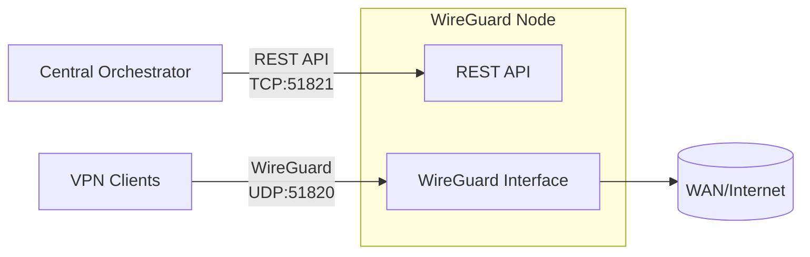

<h1 align="center">WG Keeper Node</h1>

<p align="center">
  <strong>REST API–driven WireGuard node for central orchestration at scale.</strong>
</p>

<p align="center">
  <a href="https://github.com/wg-keeper/wg-keeper-node/actions/workflows/ci.yml"></a>
  <a href="https://github.com/wg-keeper/wg-keeper-node/blob/main/LICENSE"></a>
  <a href="https://github.com/wg-keeper/wg-keeper-node/releases/latest"></a>
  <a href="https://github.com/wg-keeper/wg-keeper-node/pkgs/container/node"></a>
  <a href="https://codecov.io/gh/wg-keeper/wg-keeper-node"></a>
  <a href="https://goreportcard.com/report/github.com/wg-keeper/wg-keeper-node"></a>
  <a href="https://github.com/wg-keeper/wg-keeper-node"></a>
</p>

---

WG Keeper Node runs a WireGuard interface on a Linux host and exposes a **REST API** for peer management. It is built to be a minimal, secure node controlled by a single orchestrator that manages many nodes over HTTP.

- **Orchestration-first** — manage hundreds of nodes from one control plane  
- **Security-focused** — small attack surface, API key auth, optional IP allowlists, rate limiting  
- **Production-ready** — WireGuard stats, peer lifecycle, optional persistence, TLS, security headers  

## Table of contents

- [Why this project](#why-this-project)
- [Features](#features)
- [Architecture](#architecture)
- [Security](#security)
- [Requirements](#requirements)
- [Quick start](#quick-start)
- [Configuration](#configuration)
- [Peer store persistence](#peer-store-persistence)
- [WireGuard initialization](#wireguard-initialization)
- [Running with Docker](#running-with-docker-compose-recommended)
- [Running locally](#running-locally)
- [API reference](#api)
- [Limitations](#limitations)
- [Trademark](#trademark)

## Why this project

This project keeps each node **lean and security-focused**: small surface area and strict API control. It is built for clean automation, predictable behaviour, and low operational overhead when you scale to many nodes.

## Features

| Area | Capabilities |
|------|---------------|
| **Orchestration** | Central API layer to manage many nodes; automatic IP allocation and key rotation |
| **Security** | API key auth, optional IP allowlists, rate limiting, TLS, security headers, request ID for tracing |
| **Resilience** | Post-quantum preshared keys per peer; optional file-based peer store persistence |
| **Observability** | WireGuard stats, peer activity, auto-generated client configs |

## Architecture



## Security

- **API key authentication** on all protected endpoints.
- **Optional IP allowlist** (`server.allowed_ips`): when set, only these IPs can access protected routes; `/health` stays public.
- **Rate limiting** (when `server.allowed_ips` is not set): 20 req/s per client IP, burst 30; disabled when allowlist is set so trusted orchestrators are not limited.
- **Request body limit**: 256 KB; larger bodies get `413 Request Entity Too Large`.
- **Security headers** on every response: `X-Content-Type-Options`, `X-Frame-Options`, `X-XSS-Protection`, `Referrer-Policy`; `Strict-Transport-Security` when using TLS.
- **Request correlation**: each response includes `X-Request-Id` (UUID v4) for logs and monitoring (e.g. Prometheus, OpenTelemetry).
- Restrictive WireGuard config permissions and minimal host surface.

## Requirements

- Linux host with WireGuard support
- Root or permission to manage network interfaces
- **Docker:** `NET_ADMIN` and `SYS_MODULE`
- **Bare metal:** `wireguard-tools`, `iproute2`, `iptables`

## Quick start

1. **Clone and enter the repo**
   ```bash
   git clone https://github.com/wg-keeper/wg-keeper-node.git && cd wg-keeper-node
   ```

2. **Copy and edit config**
   ```bash
   cp config.example.yaml config.yaml
   # Edit server.port, auth.api_key, wireguard.* as needed
   ```

3. **Run with Docker Compose**
   ```bash
   docker compose up -d
   ```
   API: `http://localhost:51821` · WireGuard UDP: `51820`

4. **Create a peer**
   ```bash
   curl -X POST http://localhost:51821/peers \
     -H "X-API-Key: YOUR_API_KEY" \
     -H "Content-Type: application/json" \
     -d '{"peerId":"7c2f3f7a-6b4e-4f3f-8b2a-1a9b3c2d4e5f"}'
   ```

## Configuration

By default the app loads `./config.yaml`. Override with:

```bash
NODE_CONFIG=/path/to/config.yaml
```

| Setting | Description |
|--------|-------------|
| `server.port` | API port (HTTP or HTTPS if TLS is set) |
| `server.tls_cert`, `server.tls_key` | Optional PEM paths for HTTPS (TLS 1.2+) |
| `server.allowed_ips` | Optional list of IPv4/CIDR; when set, only these IPs can call protected endpoints |
| `auth.api_key` | API key for protected endpoints |
| `wireguard.interface` | Interface name (e.g. `wg0`) |
| `wireguard.subnet` | IPv4 CIDR for peer allocation |
| `wireguard.listen_port` | WireGuard UDP port |
| `wireguard.server_ip` | Optional server IP in the subnet |
| `wireguard.peer_store_file` | Optional path to JSON file for persistent peer store |
| `wireguard.routing.wan_interface` | WAN interface for NAT |

**Environment:** `DEBUG=true` or `DEBUG=1` enables debug logs and verbose API errors (do not use in production).

## Peer store persistence

When `wireguard.peer_store_file` is set (e.g. `peers.json`):

- **Startup:** Load peers from file (or start empty if missing), restore WireGuard device from store, reconcile with current subnets (remove peers outside `wireguard.subnet` / `wireguard.subnet6`).
- **On change:** After create/rotate/delete, the store is written atomically (temp file + rename).

| Scenario | Behaviour |
|----------|------------|
| File missing | Start with empty store |
| Empty or invalid JSON / duplicate `peer_id` | Startup fails with clear error |
| Process restart, interface unchanged | Load file; device matches store |
| Host reboot or interface recreated | Load file; re-add all store peers to interface |
| Subnet changed in config | On next startup, peers outside new subnets are removed from store and device |

**Format:** JSON array of objects with `peer_id`, `public_key`, `allowed_ips`, `created_at`, optional `expires_at`. Private keys are never stored. Create the directory with tight permissions; the process writes the file with mode `0600`.

## WireGuard initialization

On startup the node creates `/etc/wireguard/<interface>.conf` if missing and brings the interface up. In Docker this is done in `entrypoint.sh` before `wg-quick up`. If not running as root, `./wireguard/<interface>.conf` is used.

## Running with Docker Compose (recommended)

Use the example `docker-compose.yml`:

1. **Config**
   ```bash
   cp config.example.yaml config.yaml
   ```

2. **Optional:** Create `./certs` for TLS; if not using HTTPS, remove or comment the `./certs:/app/certs:ro` volume.

3. **Start**
   ```bash
   docker compose up -d
   ```

The example uses `ghcr.io/wg-keeper/node:0.0.3` (or use `edge` for latest from `main`), with `NET_ADMIN`, `SYS_MODULE`, volumes for `config.yaml` and `./wireguard`, and ports `51820/udp`, `51821`. IPv4/IPv6 forwarding sysctls and an IPv6-enabled network are set; adjust to your environment.

## Running locally

1. **Config**
   ```bash
   cp config.example.yaml config.yaml
   ```

2. **Run**
   ```bash
   go run ./cmd/server
   ```

**Commands:**

- No args — run the API server.
- `init` — ensure WireGuard config exists and exit.
- `init --print-path` — same as `init` and print config path to stdout.

## API

All protected endpoints require the `X-API-Key` header. Responses include `X-Request-Id` (UUID v4).

| Method | Path | Description |
|--------|------|-------------|
| `GET` | `/health` | Health check (public) |
| `GET` | `/stats` | WireGuard statistics (protected) |
| `GET` | `/peers` | List peers (protected) |
| `GET` | `/peers/:peerId` | Peer details and traffic (protected) |
| `POST` | `/peers` | Create or rotate peer (protected) |
| `DELETE` | `/peers/:peerId` | Delete peer (protected) |

### Stats example

```json
{
  "service": { "name": "wg-keeper-node", "version": "0.0.3" },
  "wireguard": {
    "interface": "wg0",
    "listenPort": 51820,
    "subnets": ["10.0.0.0/24", "fd00::/112"],
    "serverIps": ["10.0.0.1", "fd00::1"],
    "addressFamilies": ["IPv4", "IPv6"]
  },
  "peers": { "possible": 253, "issued": 0, "active": 0 },
  "startedAt": "2026-02-02T00:06:06Z"
}
```

### Create peer (UUIDv4)

Body: `peerId` (required), optional `expiresAt` (RFC3339), optional `addressFamilies` (e.g. `["IPv4"]`, `["IPv6"]`, `["IPv4","IPv6"]`). Omit `addressFamilies` to use all families the node supports.

```bash
curl -X POST http://localhost:51821/peers \
  -H "X-API-Key: <your-api-key>" \
  -H "Content-Type: application/json" \
  -d '{"peerId":"7c2f3f7a-6b4e-4f3f-8b2a-1a9b3c2d4e5f"}'
```

### Delete peer

```bash
curl -X DELETE http://localhost:51821/peers/7c2f3f7a-6b4e-4f3f-8b2a-1a9b3c2d4e5f \
  -H "X-API-Key: <your-api-key>"
```

## Limitations

- **In-memory peer state (default):** Without `wireguard.peer_store_file`, peer state is in memory only and is lost on restart. Use the peer store file for persistence.

## Trademark

WireGuard® is a registered trademark of Jason A. Donenfeld.
