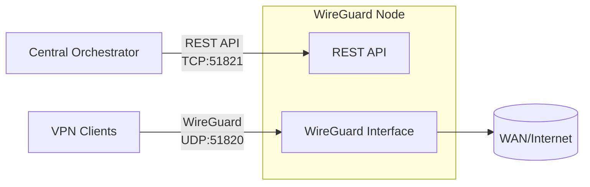

# WG Keeper node

WG Keeper node bundles a WireGuard interface with REST API for
peer management on a Linux host. It is designed to be a secure, minimal node
managed by a single admin layer that orchestrates multiple nodes via HTTP API.

## Why this project

This project keeps the node lean and security-focused with a small surface area
and strict API control. It is built for clean automation, predictable operations,
and low operational overhead.

## Key features

- built for central orchestration at scale: manage many nodes through a single API layer;
- security-first design with a minimal attack surface;
- resilient peer provisioning: automatic IP allocation and key rotation;
- post-quantum resilience via per‑peer preshared keys;
- operational visibility: WireGuard stats, peer activity, and auto-config generation.

## Security model

- API key authentication on all protected endpoints.
- Restrictive WireGuard config permissions and minimal host surface area.

## Architecture



## Limitations

- **In-memory peer state:** The mapping of peer IDs to peers is stored only in memory. After a process restart, this state is lost. Existing peer IDs will no longer be found (e.g. DELETE returns 404); a new POST with the same peer ID creates a new peer (new keys, same or different AllowedIP depending on allocation). Orchestrators should treat a node restart as an event after which peers may need to be re-created or re-attached as required.

## Requirements

- Linux host with WireGuard support.
- Root privileges or permission to manage network interfaces.
- For Docker you need `NET_ADMIN` and `SYS_MODULE`.
- If you run locally, the host must have `wireguard-tools`, `iproute2`, `iptables`.

## Configuration

Copy the example and edit it with your values:

```
cp config.example.yaml config.yaml
```

By default, the application looks for `./config.yaml`.
You can set the path explicitly:

```
NODE_CONFIG=/path/config.yaml
```

Key settings:

- `server.port`: API port (HTTP or HTTPS depending on TLS).
- `server.tls_cert`, `server.tls_key`: optional paths to TLS certificate and private key (PEM). If both are set, the API runs over HTTPS with TLS 1.2+; otherwise it runs over HTTP.
- `server.allowed_ips`: optional list of IPv4 addresses or CIDRs (e.g. `10.0.0.0/24`, `192.168.1.1`). When set, only requests from these IPs are accepted for protected endpoints (stats, peers); `/health` remains reachable from any IP. Omit or leave empty to allow all.
- `auth.api_key`: API key for protected endpoints.
- `DEBUG`: set to `true` or `1` to enable debug mode (verbose Gin logs and detailed error messages in API responses). Do not use in production.
- `wireguard.interface`: interface name (e.g., `wg0`).
- `wireguard.subnet`: IPv4 CIDR subnet for peer allocation.
- `wireguard.listen_port`: WireGuard UDP port.
- `wireguard.server_ip` (optional): server IP inside subnet.
- `wireguard.routing.wan_interface`: WAN interface for NAT rules.

## WireGuard initialization

On startup the node creates `/etc/wireguard/<interface>.conf` if missing and brings the
interface up. In Docker this happens in `entrypoint.sh` before `wg-quick up`.
If the process is not running as root, `./wireguard/<interface>.conf` is used instead.

## Run with Docker Compose (recommended)

```
services:
  wireguard:
    image: ghcr.io/wg-keeper/node:0.0.2
    restart: always
    cap_add:
      - NET_ADMIN
      - SYS_MODULE
    volumes:
      - ./config.yaml:/app/config.yaml:ro
      - ./wireguard:/etc/wireguard
      # Optional: mount TLS certs and set server.tls_cert / server.tls_key in config
      # - ./certs:/app/certs:ro
    ports:
      - 51820:51820/udp
      - 51821:51821
    sysctls:
      - net.ipv4.conf.all.src_valid_mark=1
      - net.ipv4.ip_forward=1
      - net.ipv6.conf.all.disable_ipv6=0
      - net.ipv6.conf.all.forwarding=1
      - net.ipv6.conf.default.forwarding=1
```

## Run locally

1. Prepare the config:

```
cp config.example.yaml config.yaml
```

2. Start:

```
go run ./cmd/server
```

By default, the service starts on the port from the config (`server.port`).

Allowed invocations:
- No arguments — run the API server.
- `init` — ensure WireGuard config exists and exit (logs config path).
- `init --print-path` — same as `init` and print the config file path to stdout (for scripts).
Any other first argument is treated as an unknown command and the process exits with an error.

## API

All protected endpoints require the `X-API-Key` header with the value from `auth.api_key`.

- `GET /health` — status check (public)
- `GET /stats` — WireGuard statistics (protected)
- `GET /peers` — list all peers (protected)
- `GET /peers/:peerId` — get peer details and traffic stats (protected)
- `POST /peers` — create or rotate a peer (protected)
- `DELETE /peers/:peerId` — delete peer (protected)

### Stats response example

```json
{
  "service": { "name": "wg-keeper-node", "version": "0.0.2" },
  "wireguard": {
    "interface": "wg0",
    "listenPort": 51820,
    "subnets": ["10.0.0.0/24", "fd00::/112"],
    "serverIps": ["10.0.0.1", "fd00::1"],
    "addressFamilies": ["IPv4", "IPv6"],
    "ipv6Enabled": true
  },
  "peers": { "possible": 253, "issued": 0, "active": 0 },
  "startedAt": "2026-02-02T00:06:06Z"
}
```

`wireguard.addressFamilies` shows what the node supports; `wireguard.ipv6Enabled` is true when the node has an IPv6 subnet.

### List peers

`GET /peers` returns `{ "peers": [ ... ] }`. Each item has `peerId`, `allowedIPs`, `addressFamilies`, `ipv6Enabled`, `publicKey`, `active`, `lastHandshakeAt`, `createdAt`.

### Get peer

`GET /peers/:peerId` returns `{ "peer": { ... } }` with the same fields plus `receiveBytes` and `transmitBytes`.

### Create peer example (UUIDv4)

Body: `peerId` (required), optional `expiresAt` (RFC3339), optional `addressFamilies` (e.g. `["IPv4"]`, `["IPv6"]`, or `["IPv4","IPv6"]`). If `addressFamilies` is omitted, the peer gets addresses for all families the node supports.

```
curl -X POST http://localhost:51821/peers \
  -H "X-API-Key: <your-api-key>" \
  -H "Content-Type: application/json" \
  -d '{"peerId":"7c2f3f7a-6b4e-4f3f-8b2a-1a9b3c2d4e5f"}'
```

To request IPv4-only on a dual-stack node: `{"peerId":"...", "addressFamilies":["IPv4"]}`.

### Delete peer example (UUIDv4)

```
curl -X DELETE http://localhost:51821/peers/7c2f3f7a-6b4e-4f3f-8b2a-1a9b3c2d4e5f \
  -H "X-API-Key: <your-api-key>"
```

## Trademark

WireGuard is a registered trademark of Jason A. Donenfeld.
